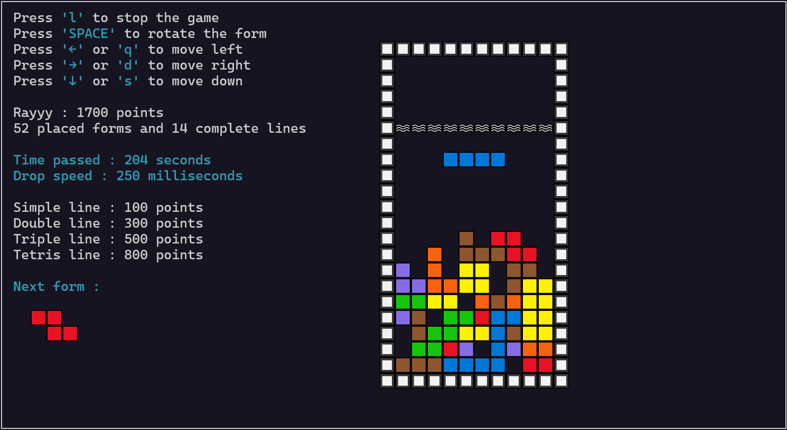

<h1 align="center">🔲 RayTris 🔲</h1>



## Introduction

**RayTris** is a game I created in C using the `ncurses` library during my second year of preparatory engineering studies to strengthen my programming skills. Inspired by the famous game **Tetris**, the game features a grid where different forms falls in until it gets to a soid area. By completing a line horizontally, the line is destroyed and all the above forms fall down a notch. The player's score is increased depending on the number of lines completed simultaneously, and the goal is to reach the highest score while avoiding making any block exceed the limit at the top.

## Prerequisites

- **C compiler** such as `gcc` is required to compile the game.
- `ncurses` library to manage the game's terminal-based interface.

## Installation

1. **Install the `ncurses` library with the following command :** 
```sh
sudo apt-get install libncurses5-dev libncursesw5-dev libncurses5 libncursesw5
```

2. **Clone the repository :** 
```sh
git clone https://github.com/RayyyZen/RayTris.git
```

3. **Move into the project folder :** 
```sh
cd RayTris
```

4. **Compile and run the project :**
```sh
make run
```
- **OR**
```sh
make && ./RayTris
```

## Game instructions


### Menu options 
- New game : Start a new game session
- Resume game : Load the last saved game
- Exit : Quit the game

### Game modes 
- #### Normal mode 
- #### Custom mode

### Game controls :
- `ENTER` : Select a menu option
- `SPACE` : Rotate a form
- `←` or `q` : Move left
- `→` or `d` : Move right
- `↓` or `s` : Move down
- `b` : Return back in menu
- `l` : Stop or leave the game
- `m` : Return to menu

### Gameplay :

1. .

2. .

## License

This project is licensed under the BSD 2-Clause License. See the [LICENSE](LICENSE) file for details.